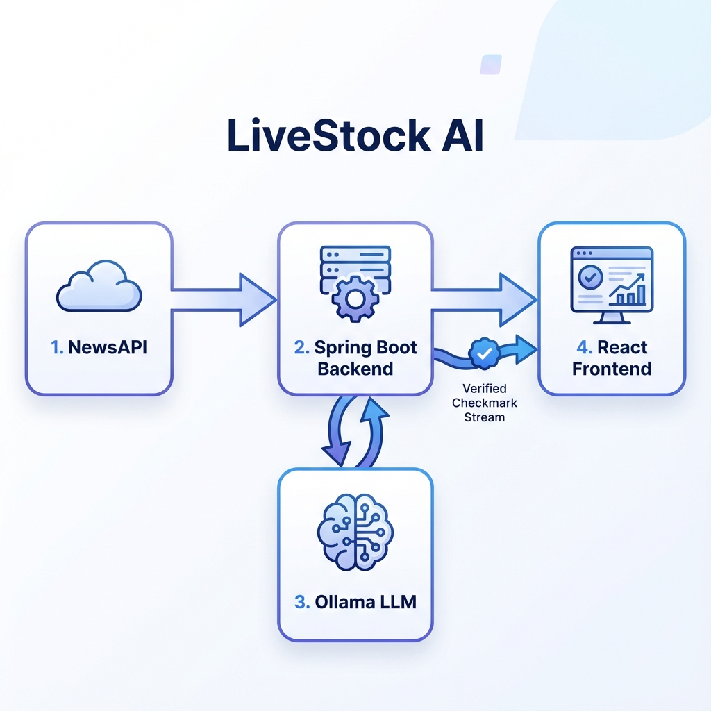
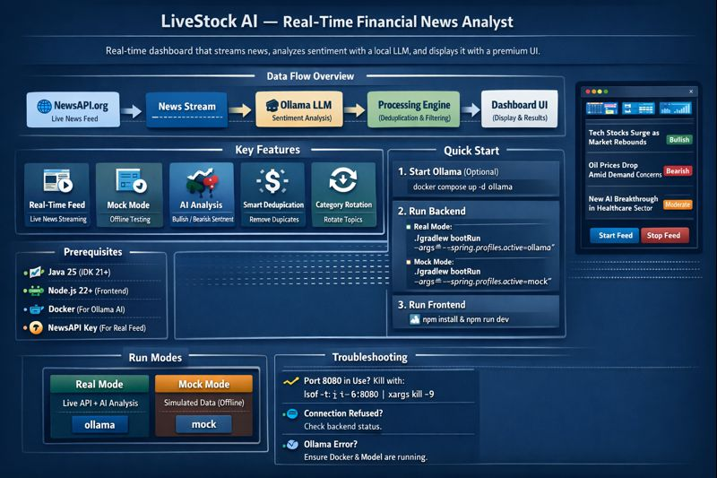
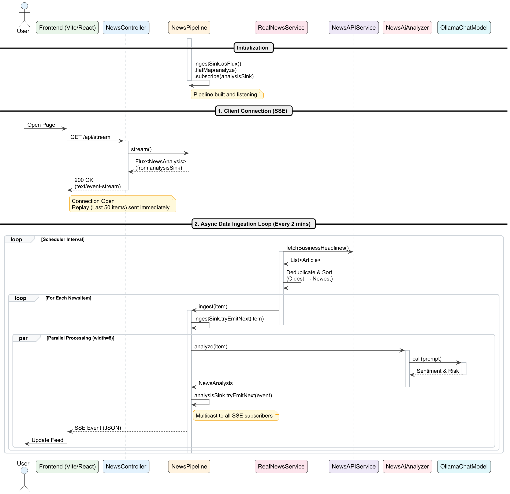

# LiveStock AI — Real-Time Financial News Analyst

A real-time financial news dashboard that streams live news, analyzes sentiment using a local LLM (Ollama), and displays it with a premium UI.




## Data Flow




## Features
- **Real-Time Feed**: Streams live business, tech, and science news via NewsAPI.org.
- **Mock Mode**: Supports offline development with local mock data (no API key needed).
- **AI Analysis**: Uses local LLM (Ollama w/ Llama 3.2) to analyze sentiment (Bullish/Bearish) and risk.
- **Smart Deduplication**: Automatically filters out duplicate news items.
- **Live Category Rotation**: Cycles through different news topics to keep the feed fresh.
- **Reliable Streaming**: Replays recent news on reconnection so you never see an empty screen.

---

## Prerequisites
- **Java 25** (JDK 21+ required)
- **Node.js 22+** (for Frontend)
- **Docker** (for running Ollama, optional if using Mock profile)
- **NewsAPI Key** (Required for Real Feed profile)

---

## Quick Start

### 1. Start AI Engine (Ollama) - *Optional for Mock Profile*
Run this if you want to use the real AI analysis with local LLM.

```bash
# Start Ollama container
docker compose up -d ollama

# Pull the model (only needed once)
docker exec -it livestock-ollama ollama pull llama3.2
```

### 2. Run Backend (Spring Boot)
Open a terminal in the project root (`LiveStock-AI/`):

#### Option A: Real Data + AI (Requires API Key & Ollama)
```bash
./gradlew bootRun --args='--spring.profiles.active=ollama'
```

#### Option B: Mock Data (Offline, No API Key needed)
Great for UI development and testing without using API quotas.
```bash
./gradlew bootRun --args='--spring.profiles.active=mock'
```

*The backend will run on `http://localhost:8080`.*

### 3. Run Frontend (React)
Open a **new terminal** in `LiveStock-AI/frontend/`:

```bash
cd frontend
npm install  # Install dependencies (first time only)
npm run dev
```

*The frontend will open at `http://localhost:5173`.*

---

## Usage

1.  Open **http://localhost:5173**.
2.  Click **"Start Feed"**.
3.  Watch real-time analyzed news appear instantly!
    - In **Mock Mode**, you'll see simulated news items.
    - In **Real Mode**, you'll see live headlines from NewsAPI.
4.  Click **"Stop Feed"** to pause streaming.

---

## Configuration

**API Key** (For Real Mode):
To use the real news feed, set the `NEWS_API_KEY` environment variable or edit `src/main/resources/application.yml`:

```yaml
news:
  api:
    key: "YOUR_API_KEY_HERE"
```

**Profiles**:
- `ollama`: Real News API + Ollama AI
- `mock`: Local File Data + No-Op AI (Offline)

---

## Troubleshooting

-   **"Port 8080 already in use"**:
    Kill duplicated java processes: `lsof -t -i:8080 | xargs kill -9`
-   **"Connection Refused"**:
    Ensure the backend is running and fully started (look for "Started LiveStockAiApplication" in logs).
-   **"Ollama Connection Error"**:
    Make sure Docker is running and you pulled the model (`step 1`). If using Mock profile, this shouldn't happen.
